<div align="center">

# 🎨 字狂潮 v2 · 局外成长

**基于《火柴人大战数字》v1.7.3（b25）的续作分支 —— 新增全局货币「粉笔」+ 8 项永久强化。v1 原版冻结于 `../火柴人大战数字/`，不再改动。**

> 运行：`python -m http.server 8912` → `http://127.0.0.1:8912/`（v2 独立存档 `svsn_v2`；首次启动自动迁移 v1 进度，不回写 v1）
>
> 🌿 **GitHub**：发布于 [stickman-vs-numbers](https://github.com/296711867/stickman-vs-numbers) 仓库的 **`v2` 分支**（`main` = v1 冻结版）。本地迭代后运行 `bash push-v2.sh` 一键更新该分支。

## 🆕 v2 新增：局外成长

- **粉笔（全局货币）**：每局结束按 击杀×1 + 通关奖励100 结算，「聚沙成塔」强化可 +10%/级
- **永久强化商店**：选关页右下「🔧 强化」按钮或 **B 键**进入；数字键 1~8 / 点卡片购买
- **8 项强化**（满级合计 ≈9700 粉笔）：

| 强化 | 效果 | 满级 |
|---|---|---|
| 心之容器 | 开局心血上限 +1 | 3 |
| 轻快步伐 | 移速 +4%/级 | 5 |
| 幸运星 | 掉率 +10%/级 | 5 |
| 磨尖笔尖 | 武器冷却 -4%/级 | 5 |
| 磁力搅拌 | 拾取范围 +15%/级 | 3 |
| 速记口诀 | 经验获取 +8%/级 | 5 |
| 预习卷轴 | 开局等级 +1 | 2 |
| 聚沙成塔 | 粉笔结算 +10%/级 | 5 |

- **结算显示**：失败/通关/全通画面显示「粉笔 +N」
- 自动测试已覆盖 meta 路径（购买/扣费/价格递增/属性生效/结算公式/商店渲染）

## 🆕 v2.2 新增：收集图鉴

- **25 格图鉴**：15 种怪（数字兵/加号/减号/乘号/除号/根号/φ/∞/负数/分数/幻影/∫/Σ/精英）+ 10 个 BOSS
- **首杀点亮**：击杀即收录（存档 `STORE.codex`）；未收录显示暗色剪影 + ？？？ +「击败后收录」
- **里程碑奖励**：图鉴完成度 25/50/75/100% 各发一次粉笔（40/80/150/300，合计 570）
- 入口：选关页「📖 图鉴」按钮或 **T 键**；图鉴页 Esc 返回

## 🆕 v2.1 新增：成就与存档

- **成就 ×10**（选关页「🏆 成就」按钮或 **C 键**查看）：击杀三连（50/100/300）、笔锋觉醒（首次进化）、全武装（4 武器）、磨到满级（Lv5）、弑君者（首杀 BOSS）、毫发无伤（无伤通关）、轮回行者/永恒课堂（无尽 2/3 轮）
- 成就解锁瞬间弹 toast，**奖励以粉笔发放**（30~250/项，合计 1180）
- **存档导入/导出**：成就页底部按钮——导出=JSON 复制到剪贴板；导入=粘贴覆盖（校验格式）
- 自动测试覆盖 ach 路径（击杀解锁/幂等/奖励到账/成就页渲染）

---

# 以下为 v1 原版说明

**Stickman vs Numbers · Number Tide**

俯视角 2D 割草木鸽（Roguelite）· 与《火柴人大战数学》同一世界观

**数字怪的头顶数字就是血条 —— 挨一下 -1，减到 0 碎成粉笔屑。**


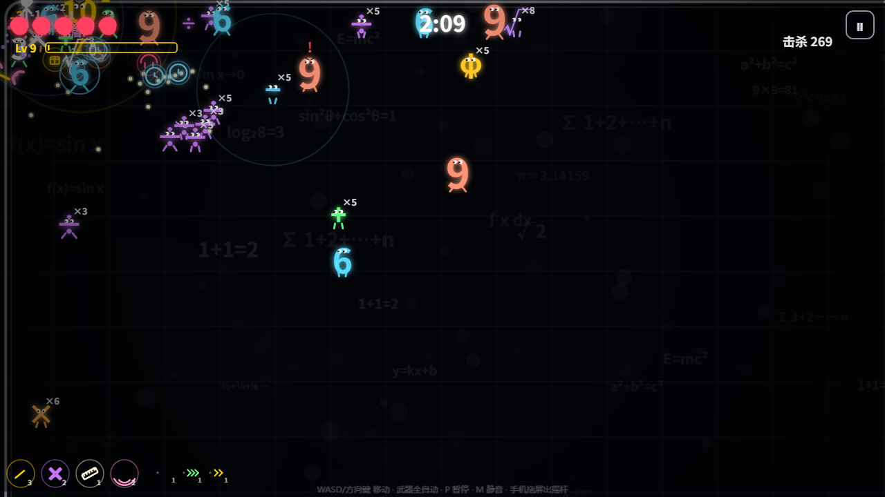

*第九关《函数迷宫》：∫ 兵正弦弹道弹幕 · 荧光黑板风*

<br>

</div>

---

## 🎮 先睹为快

| 标题画面 | 选关（5+5 网格 · 通关✓角标） |
|---|---|
| 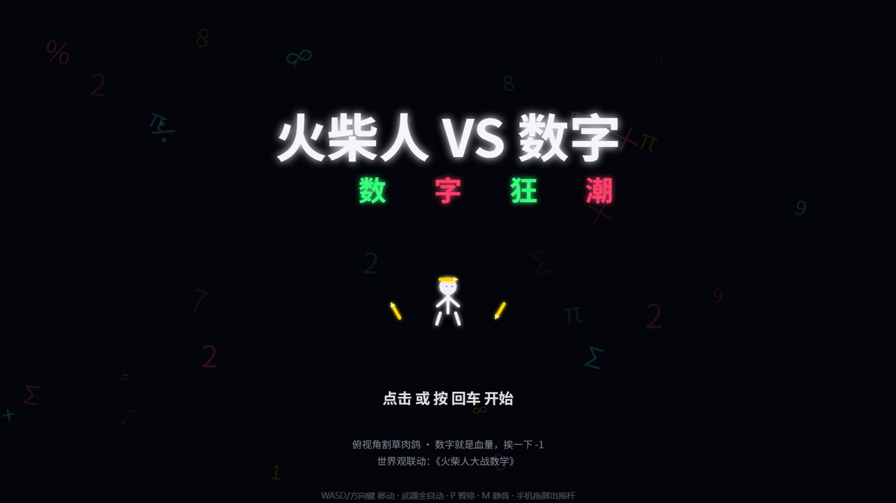 | 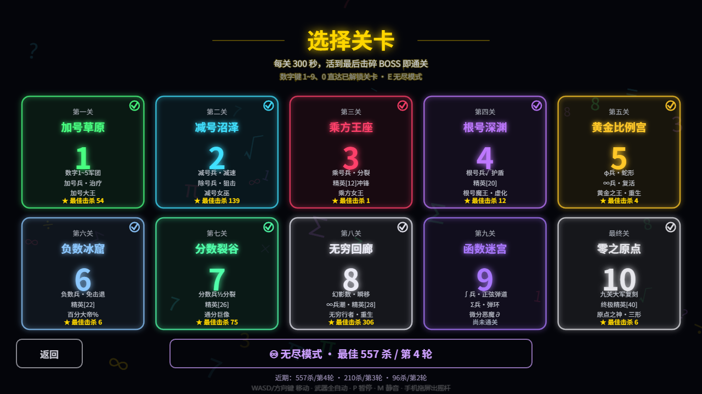 |
| **进化卡**（满级+专属被动 → 金色进化） | **BOSS 战**（原点之神 · 三形态） |
| 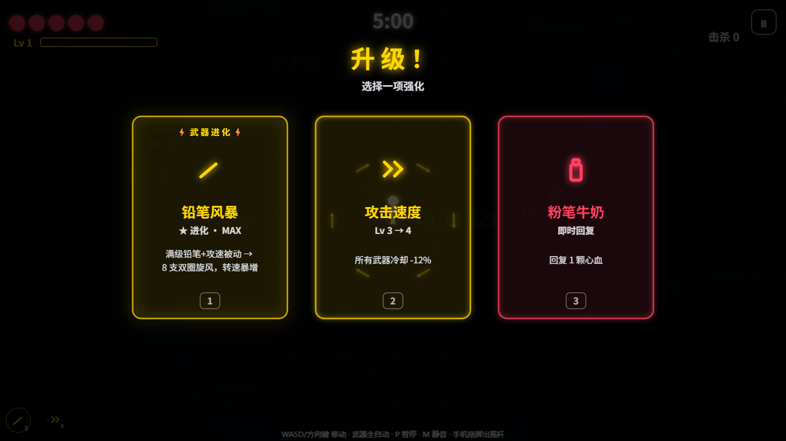 | 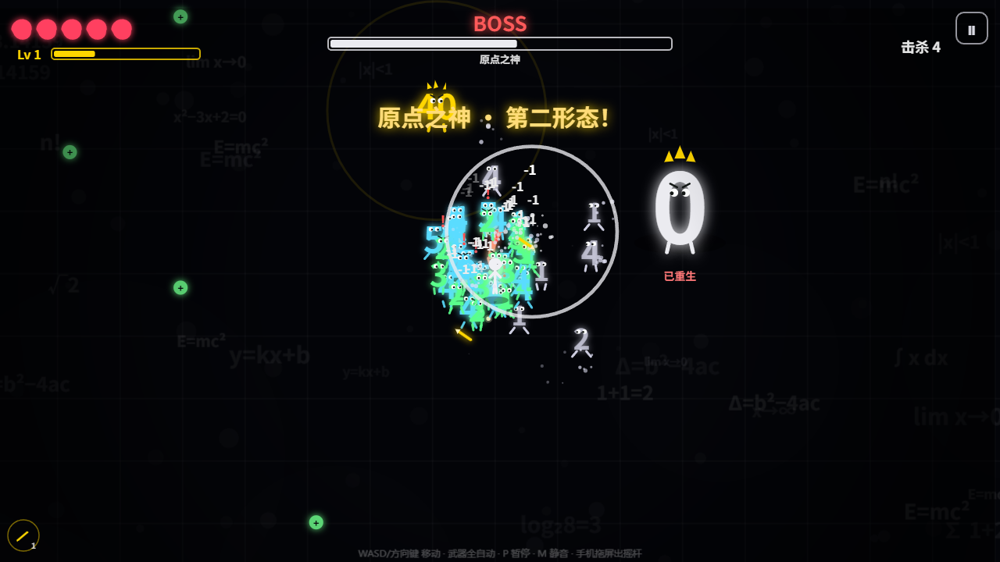 |
| **♾ 无尽模式**（轮次+场景轮换） | **手机竖屏**（虚拟摇杆） |
| 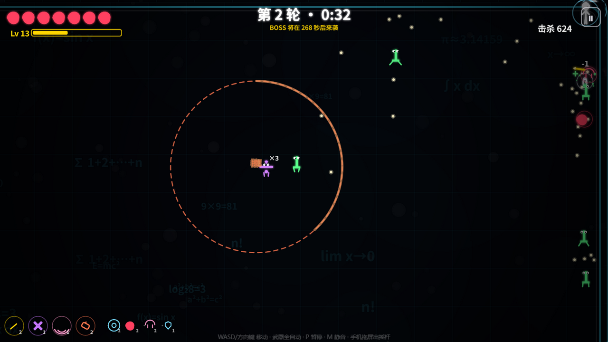 | 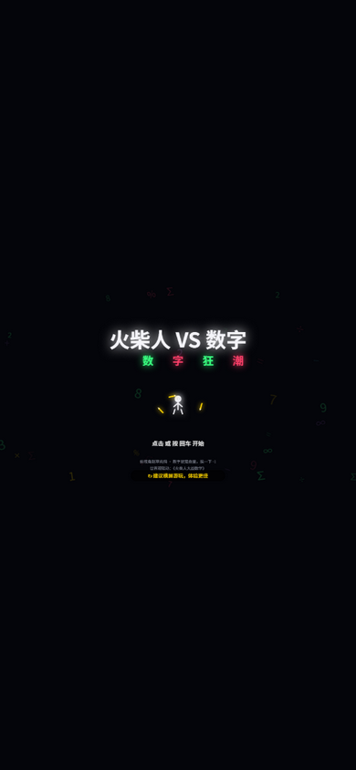 |

<details>
<summary><b>📸 更多截图</b>（进化形态 / 全通彩蛋 / 旧版三选一）</summary>
<br>

| **铅笔风暴**（进化后 8 支双圈 + HUD ★） | **全通彩蛋**（原点之神终章 + 前作联动） |
|---|---|
| 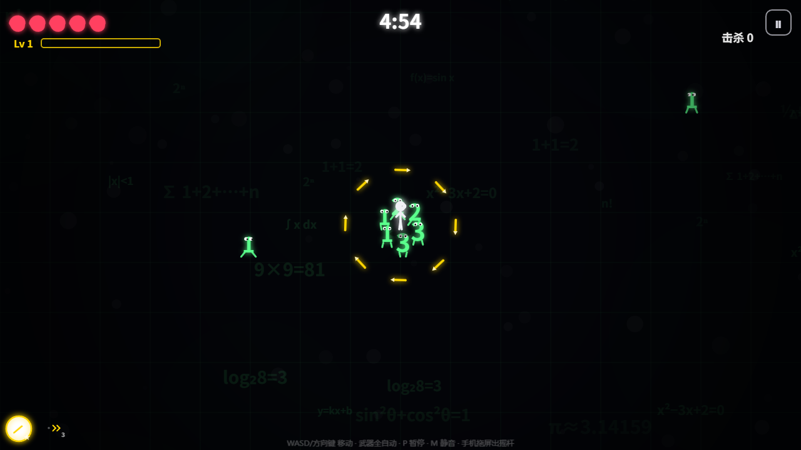 | 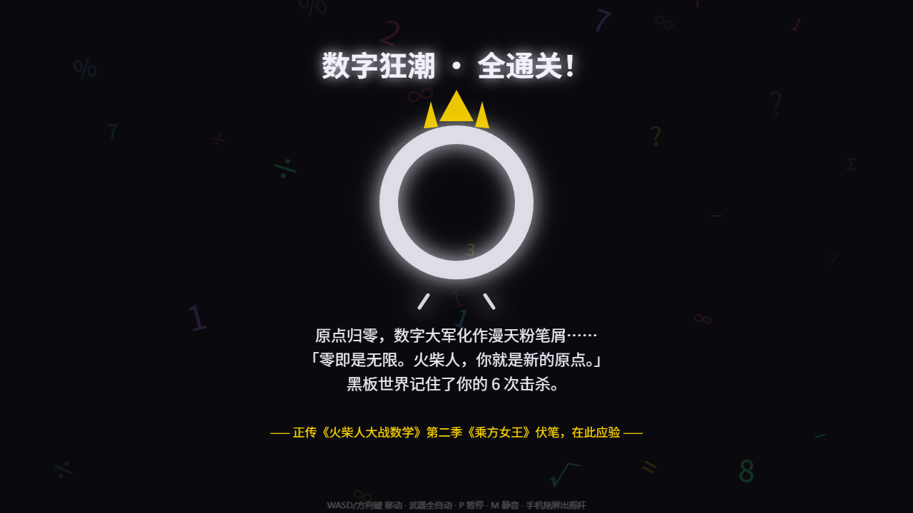 |
| **升级三选一** | **手机横屏对局**（摇杆 + HUD） |
| 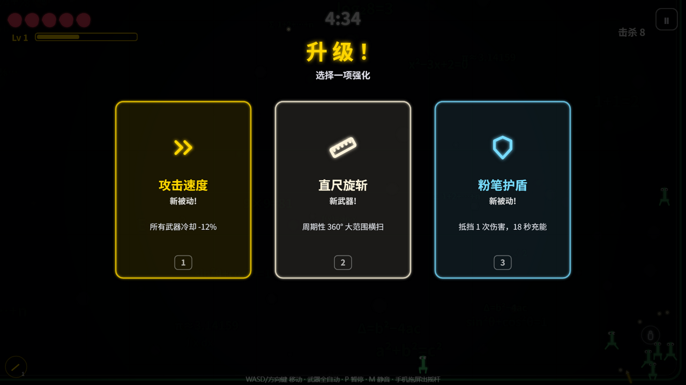 | 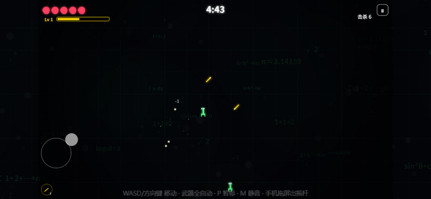 |

</details>

---

## 一、快速开始

### 运行

```bash
cd 火柴人大战数字
python -m http.server 8911
# 浏览器打开 http://localhost:8911/
```

也可直接双击 `index.html`（纯静态、无网络依赖；file:// 下个别浏览器不存进度）。
局域网手机游玩：电脑起服务器后，手机浏览器开 `http://<电脑IP>:8911/`。

### 操作

| 输入 | 动作 |
|---|---|
| WASD / 方向键 / 拖屏 | 移动（拖屏=动态虚拟摇杆，支持触屏） |
| 武器 | 全自动，无攻击键 |
| 1 / 2 / 3 … 或点击 | 升级三选一 |
| 数字键 1~9、0 | 直达已解锁关卡（选关页） |
| E | 无尽模式 |
| B / 🔧按钮 | 永久强化商店（选关页） |
| C / 🏆按钮 | 成就页（选关页） |
| P / Esc / 右上角⏸ | 暂停 |
| R | 快速重开本关（暂停/失败/通关画面） |
| M | 静音（任意画面，有提示浮条） |
| 切后台 / 切标签页 | 自动暂停（战斗中） |

### 手机端

- **触屏**：按住屏幕任意位置即出现动态虚拟摇杆；菜单/三选一/暂停全部可点
- **横竖屏**：都可玩（竖屏有"建议横屏"提示），转屏自动适应
- **性能模式**：暂停菜单里可开（关闭发光/暗角特效），手机掉帧时使用，设置会存档

---

## 二、游戏内容

### 模式

| 模式 | 规则 |
|---|---|
| 战役 | 10 关 ×300 秒，每关波次推进 → BOSS 战 → 通关解锁下一关（**已完结**） |
| ♾ 无尽 | 300 秒一轮，每轮末轮换 BOSS（血量 +25%/轮），杀掉回 1 心 + 换场景主题进下一轮；怪潮逐轮加强；最佳记录 + 最近 5 局战绩存档并在选关页展示 |

### 关卡总览（10 关全部完结）

| # | 关卡 | 主题色 | 新怪/机制 | BOSS |
|---|------|--------|-----------|------|
| 1 | 加号草原 | 荧光绿 | 数字 1~5、加号兵(死亡+2治疗) | 加号大王 |
| 2 | 减号沼泽 | 荧光青 | 减号兵(减速光环)、除号兵(÷狙击)、减速水洼、精英[10] | 减号女巫 |
| 3 | 乘方王座 | 荧光红 | 乘号兵(死亡分裂)、精英[12]三波冲锋 | 乘方女王 |
| 4 | 根号深渊 | 荧光紫 | 根号兵√(护盾弹开一击)、精英[20] | 根号魔王(虚化免疫+'i'弹环) |
| 5 | 黄金比例宫 | 荧光金 | φ兵(蛇形突进)、∞兵(复活一次)、精英[25][30] | 黄金之王φ(黄金螺旋+引力+∞重生) |
| 6 | 负数冰窟 | 冰蓝 | 负数兵(−n显示，免疫击退)、冰面滑区、精英[22] | 百分大帝% |
| 7 | 分数裂谷 | 翠绿 | 分数兵½(一分为二成两只¼，仅一次)、精英[26] | 通分巨像½ |
| 8 | 无穷回廊 | 荧光白 | 幻影数(受击瞬移)、∞兵大潮、精英[28] | 无穷行者∞(双重生) |
| 9 | 函数迷宫 | 青紫 | ∫兵(正弦波弹道弹幕)、Σ兵(环绕弹环)、精英[32] | 微分恶魔∂ |
| 10 | 零之原点 | 黑白终章 | 前9关12种怪全员复刻、终极精英[40] | 原点之神0(三形态+双重生) |

### 武器与进化

6 把全自动武器（各 5 级，最多同时装 4 把）：
**铅笔环绕**(初始) / **直尺旋斩** / **符号卫星**(+击退 −减速 ×击爆 ÷高频) / **粉笔射手**(锁敌+穿透) / **橡皮回旋镖**(双程) / **黑板擦炸弹**(范围-8)

**进化系统**：武器满级 Lv5 + 持有专属被动 → 升级三选一首位必出**金色进化卡**（单次命中仍 -1，进化只放大数量/频率/范围/特效）：

| 满级武器 + 专属被动 | 进化形态 | 效果 |
|---|---|---|
| 铅笔环绕 + 攻速 | 铅笔风暴 | 8 支双圈旋风，转速暴增 |
| 直尺旋斩 + 范围 | 圆规巨斩 | 半径×1.5，冷却减半，击退翻倍 |
| 符号卫星 + 会心 | 公式矩阵 | 8 星高速，命中溅射周围 |
| 粉笔射手 + 移速 | 神速投手 | 8 连发，无限穿透 |
| 橡皮回旋镖 + 幸运 | 黄金回旋镖 | 4 枚巨镖超远，命中减速 |
| 黑板擦炸弹 + 心容器 | 末日黑板擦 | 3 连大轰，爆心追加伤害 |

进化后 HUD 武器图标变金框 ★ 标。

### 被动 ×8（最多带 4 个）

攻速 / 范围 / 磁力 / 移速 / 心上限 / 幸运 / 暴击 / 护盾

### 道具 ×6（怪死概率掉落，幸运提升掉率）

🥛牛奶(回心) 🧲磁铁(吸屑) ⏱️时钟(冻结3s) 💣黑板擦(全屏-8) 📦礼盒(武器+1级) ❤️红心(上限+1)

### 怪物图鉴 ×15（数字=血量，挨一下-1）

数字 1~11（越小越快，≥6 会蓄力冲撞）/ 加号兵+(死亡治疗) / 减号兵−(减速光环) / 乘号兵×(死亡分裂) / 除号兵÷(远程狙击) / 根号兵√(护盾弹开) / φ兵(蛇形突进) / ∞兵(复活一次) / 负数兵−n(免疫击退) / 分数兵½(一分为二) / 幻影数(受击瞬移) / ∫兵(正弦波弹道) / Σ兵(环绕弹环) / 精英双位数[10]~[40](加速光环)

### BOSS 系统

- **技能池 ×14** 任意组合即成新 BOSS：cross冲撞 / ring弹环 / summon召唤 / fan扇刃 / nova减速新星 / blink瞬移 / expo指数弹幕 / charge三连冲 / guard卫士 / crown皇冠坠落 / phase虚化 / spiral黄金螺旋 / vortex引力 / tide弹幕潮
- **通用渲染**：`BOSS_DEF` 写 `char` 字符即自动生成形象（大字符+金冠+怒目+小短腿）
- **多阶段**：`phasePats: [[阶段1技能],[阶段2]…]` 每条命换技能池（原点之神三形态）；`reviveN: N` = N 次∞重生（血量 55%→32% 递减）；`phaseBanners` 自定义阶段横幅

> 存档：localStorage `svsn_v1`（解锁进度/每关最佳击杀/无尽最佳+战绩历史/静音/性能模式）。全通彩蛋呼应前作《火柴人大战数学》第二季《乘方女王》伏笔。

### ♾ 移植动态

- **微信小游戏版**基于 v1 b25 基线，**v2 的货币/成就/商店尚未同步到小游戏**（需要时把 v2 的 globals/player/items/upgrades/boss/enemies/scenes/sketch 差异同步进 `../火柴人-微信小游戏/小游戏工程/porting-baseline/` 后重建 bundle）
- **微信小游戏版**移植工程已启动：p5 兼容层方案，第 1 关已在开发者工具实测可玩。工程与发布文档见 `../火柴人-微信小游戏/`，阶段 3-6（音效真机调优/分享/提审）进行中

---

## 三、扩展开发手册（后续 AI 迭代必读）

架构是**数据表驱动**的：加一关 = 改 3 张表，**零逻辑代码**。选关页卡片（5+5 双行网格自适应）、解锁链、无尽模式 BOSS 轮换、场景主题、存档全部自动适配新关卡。

### 数据表架构

```
LEVELS      (globals.js)   关卡表：主题色/BOSS/水洼数/特性文案（顺序=关卡号）
LV_WAVES    (enemies.js)   波次表：持续刷怪 cont + 事件 events
BOSS_DEF    (boss.js)      BOSS表：血量/字符/技能池/phasePats三形态/reviveN重生
KIND_COL/CHAR/行为分支      怪物图鉴（enemies.js）
弹幕系统                    直线 bshot / 正弦波 wave 弹道 / ÷刃 / 落点预警
```

### 加一关的 3 步

1. **`js/globals.js` → `LEVELS`** 追加一条（顺序即关卡号）：
   ```js
   { name: '新关名', tag: '第十一关', col: [R,G,B], dim: [R,G,B暗色], boss: 'bossKey', puddles: 0,
     feats: ['特色怪一行(≤9字)', '精英[n]', 'BOSS 名·机制'] },
   ```
   - `col` 主题色（格线/涂鸦/边框/通关字），`dim` 背景暗晕色，`puddles` 减速水洼数量
2. **`js/enemies.js` → `LV_WAVES`** 追加同号条目：
   ```js
   11: {
     cont: [ { t0: 0, t1: 300, kind: 'num', hp: 5, every: 1.5, n: 2 }, ... ],   // 持续刷怪
     events: [ { t: 2, banner: '第十一关 · 新关名' }, { t: 150, elite: 34 }, { t: 215, ring: { n: 16, kind: 'num', hp: 7 } }, ... ],
   },
   ```
   - `cont`：`t0/t1` 生效时间窗、`kind` 怪种、`hp` 血量(=受击次数)、`every` 间隔秒、`n` 每次只数
   - `events`：`banner` 横幅 / `ring: {n,kind,hp}` 环形合围 / `elite: n` 精英
3. **`js/boss.js` → `BOSS_DEF`** 追加一条：
   ```js
   bossKey: { name: '新BOSS', hp: 320, r: 52, spd: 92, col: [R,G,B], char: '?', pats: ['ring', 'spiral', 'summon', 'crown'] },
   ```
   - `char`：BOSS 大字符（通用渲染自动画）
   - `pats` 从 14 技能池选；可选 `reviveN: 2`（多次重生）、`phasePats`（多阶段换池）、`phaseBanners`（阶段横幅）
4. （可选）`js/sketch.js` → `runAutoTest` 加 `guard('lv11', ...)` 与 BOSS 路径

### 加一只新怪（需要动代码时）

`js/enemies.js`：`KIND_COL/KIND_CHAR` 配色字符 → `spawnEnemy` 速度/体型 → `updateEnemies` 行为分支 → `hurtEnemy` 特殊受击 → `drawEnemies` 绘制分支 → `killEnemy` 死亡特效。
参考实现：负数兵（免疫击退，3 行）、根号兵（护盾循环）、∞兵（复活）、幻影数（受击瞬移）。

### 验证清单（每次改动后）

1. `node --check js/*.js` 全过
2. `?t=1` 自动测试 0 错误（无头快进 10 关波次/全 BOSS/道具/进化/无尽轮次，读 `window.__AT_ERR`）
3. `index.html` 脚本引用版本号 `?v=N` +1（每改一个文件就单独 +1，防缓存）
4. 选关/对局/BOSS 截图目检（存 `_review/`）

### 已知约束

- 数字怪 `hp` 上限 11 显示效果最佳（>11 仍可玩，数字会缩小）
- 选关页特性行 ≤9 字符（超宽会自动缩字号，但太长仍难读）
- 全通彩蛋文案在 `js/scenes.js → drawAllclear`，大改世界观时记得同步
- 武器进化映射表在 `WDEF[id].evo.pass`，加第 7 把武器记得配专属被动

---

## 四、技术要点

- **p5.js 2.3.2** 本地 lib，纯程序化美术（无素材）：荧光黑板 = 纯黑底 + 高饱和粉笔描边 + `shadowBlur` 发光，背景格线/涂鸦按关卡主题烘焙进 2400×1800 离屏缓冲
- **WebAudio** 全合成音效（无音频文件）；慢动作/震屏/-1 飘字/粉笔尘粒子
- 相机跟随竞技场（2400×1800），屏幕外环形刷怪，同屏上限 80-90
- **手机适配**：Pointer Events 虚拟摇杆、全画面 letterbox（菜单/HUD/世界统一 1280×720 逻辑坐标）、真实视口自校验 `realW/realH`、性能模式 LOWFX
- **自动测试**：`?t=1` 无头快进全部逻辑路径（十关波次/全 BOSS 含三形态/道具/武器进化/无尽轮次）

## 五、目录结构

```
index.html  style.css  策划案.md  README.md
lib/p5.min.js
js/globals.js   常量/LEVELS关卡表/存档/特效/背景烘焙/图标
js/audio.js     WebAudio 合成音效
js/player.js    火柴人（心血/移动/受击/绘制）
js/weapons.js   6 武器定义(含进化) + 投射物/弹幕 + 伤害结算
js/enemies.js   怪物图鉴 + LV_WAVES波次表 + 刷怪器(战役/无尽)
js/items.js     粉笔屑经验 + 掉落道具
js/upgrades.js  升级三选一卡池（含金色进化卡）
js/boss.js      BOSS_DEF表(技能池/三形态) + BOSS逻辑 + 通用渲染
js/scenes.js    对局主循环/HUD/标题/选关(5+5网格)/结算/彩蛋
js/sketch.js    入口/输入分发/自动测试
_review/        验收截图（网页版 t-*.png / 微信版 wx-*.png）
_wxp/           微信小游戏移植的浏览器验证 harness（bundle 为构建产物）
软件著作权申请资料/  软著申请材料（本地保留，不入库）
```

## 六、后续制作建议（Backlog）

> 按"性价比"排序。**⚡ = 已列入近期待办（用户点名优先）**。加关卡直接照第三节手册操作，零门槛。

### 🎯 内容扩展（改数据表即可，成本最低）

- **第 11+ 关**：按加关指南 3 张表续作——候选主题：《矩阵回廊》（矩阵兵，横排盾阵）、《极限峡谷》（lim 兵，渐进加速潮）、《阶乘炼狱》（n! 兵，血量滚雪球）
- **新武器 ×3**：圆规两脚规（双向旋转激光）/ 三角板（三角散射弹幕）/ 量角器（扇形多向弹幕）——记得在 `WDEF` 配 `evo` 专属被动
- **新怪**：绝对值兵 |n|（受击后血量取绝对值，负伤回正）、循环节兵 0.nnn（周期性短暂无敌）
- **精英词缀系统**：随机词缀叠加（狂暴/吸血/分裂/迅捷），血量×3 金色变异体，无尽模式每 5 轮来一波"变异潮"

### ⚙️ 系统深化（需要写代码，单系统 1-2 小时）

- ⚡ **局外成长**：粉笔货币（按击杀结算）+ 永久强化树（初始+1心/移速+5%/掉率+10%…），存 `STORE.meta`
- **成就系统**：首次进化 / 无伤通关 / 单局百杀 / 全武器毕业…成就页 + 解锁弹窗
- **每日挑战**：固定随机种子的每日关卡（`seedrandom` 或自写 LCG），本地排行
- **挑战模式**：玻璃大炮（1 心）/ 限定武器 / 禁道具 等 modifier 组合
- **收集图鉴**：怪物/武器/进化形态解锁制图鉴页（首次击杀点亮）
- **双人同屏**：Gamepad API 双摇杆，共享屏幕分左右

### ✨ 体验打磨（小而美）

- ✅ **BGM**（2026-10-10）：WebAudio 合成 chiptune 循环已上线——menu（84BPM 柔和琶音）/ battle（132BPM 低音+旋律+hat）/ **boss（142BPM 紧张变奏，BOSS 活跃自动切换）** 三套随场景自动切换，零音频文件；实现见 `js/audio.js` 尾部，调参 `_BGM_V`/`_BGM_PATTERNS`/`_BGM_BPM`
- **局内商店**：每 100 秒刷新商店（花击杀数买道具/武器级）
- ✅ **快捷重开 R 键**（2026-10-10：暂停/失败/通关画面生效）；死亡瞬间回放慢镜（slowmo 已有 1.1s，回放待做）
- **存档导入/导出**：JSON 复制粘贴（换设备/备份）
- **PWA**：manifest + service worker，手机"添加到主屏幕"离线可玩

### 🔧 工程升级（发布向）

- GitHub Pages 上线（Settings → Pages → main 分支）→ About 的 Website 填 Pages 链接，README 即落地页
- itch.io / Cortex 分发（zip 静态包直接传）
- 打包桌面版：Tauri（轻量）或 Electron
- 模块化改造：ES modules + vite 构建（当前为全局脚本顺序加载）
- 多语言：界面文案抽成 `LANG` 表（en/zh）

## 七、版本史

| 版本 | 内容 |
|---|---|
| v1.0 | 3 关 MVP（草原/沼泽/王座 + 3 BOSS + 6 武器 + 三选一） |
| v1.1 | 扩到 5 关 + ♾ 无尽模式 + 手机触屏/性能模式 |
| v1.2 | 规划 10 关 + 加关指南 + 第 6 关《负数冰窟》 |
| v1.3 | 第 7 关《分数裂谷》（分数兵½） |
| v1.4 | 第 8 关《无穷回廊》（幻影数 + 双重生 BOSS） |
| v1.5 | 第 9 关《函数迷宫》（∫/Σ 弹幕兵 + 正弦波弹道系统） |
| v1.6 | 第 10 关《零之原点》终章，**10 关战役完结**（三形态 BOSS phasePats） |
| v1.7 | 武器进化（6 金卡）+ 无尽战绩历史 |
| v1.7.1 | 选关页重排：5+5 双行网格 + ✓角标/手绘锁/快捷键直达 |
| v1.7.2 | 微信小游戏移植启动：p5 兼容层 shim + bundle 构建 + 第 1 关可玩（工程见 ../火柴人-微信小游戏/） |
| v1.7.3 | 细节打磨：时钟冻结可视化（❄+剩余时长+全屏淡蓝）、剩 1 心红色脉动警示+心形跳动、R 键快速重开（暂停/失败/通关）、通关画面 Enter=进入下一关、静音 toast 反馈、切后台自动暂停 |
| **v2.0** | **（新分支起点）全局货币「粉笔」**（击杀结算）+ 8 项永久强化商店（B 键/🔧）+ 结算粉笔显示 + 独立存档 svsn_v2 |
| **v2.1** | **成就系统 ×10**（C 键/🏆，奖励粉笔 1180/全解锁）+ 存档导入/导出 + play.hurtCount 伤害追踪 |
| **v2.2** | **收集图鉴 ×25**（T 键/📖，首杀点亮 + 剪影悬念）+ 里程碑粉笔奖励 570/全集 + 选关页五按钮布局 |
| v1.8（备选） | 局外粉笔货币+永久强化、成就系统 |
